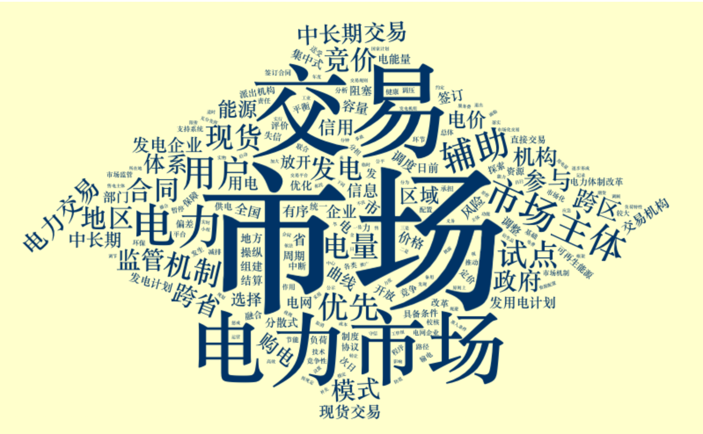

```{r setup, include=FALSE}
knitr::opts_chunk$set(echo = TRUE, warning=FALSE, message=FALSE)
```

# Part 1

## Preface

China's electricity system reform is an important part of China's economic reform process. In 2015, a new round of power system reform formulated the institutional framework naming “controlling the middle and liberalizing the two ends”. This means limiting the monopoly power of the grid company occupying the "middle" part, and liberalize the users side and the generation side, which are the "two ends", and once have been regulated by the generation and consumption plan made by the government. In the power industry, China is gradually transitioning from a planned economy to a market economy. 

This process has been driven by a series of detailed policies. In recent years, China's electric power reform has certain achievements, but many policies are far from successful. For example, the theme of one of the six supporting documents of "the No.9 Document", the pilot reform of incremental power distribution, by the end of 2020, only one fifth of the pilots survived to obtain operational qualification. In this context, our core concern is: to what extent, did the array of policy concepts brought up at 2015 still seems feasible and even successful? To what extent, on the contrary, these concepts were already abandoned and substituted by other new concepts?

This part of the study will inspect a series of national-level policy documents issued by the government from 2015 to 2020, using a set of techniques of text mining.

### 1. Set Up Packages

```{r setup packages, warning=FALSE, message=FALSE}
library(dplyr)
library(tidyverse)
library(tidymodels)
library(textrecipes)
library(jiebaR) 
 # the Chinese tokenizer package
library(purrr)
library(ggplot2)
library(wordcloud2)
library(RColorBrewer)
library(topicmodels)
library(tidytext)
library(quanteda)
library(SnowballC)
library(sentimentr)
library(reshape2)
library(wordcloud)
library(textdata)
```

### 2. Build Up Corpus

The document issued by the Central Committee of the Communist Party of China and the State Council in March 2015, "Several Opinions on Further Deepening the Reform of the Electric Power System" (also been called, "the No.9 Document"), and six supporting documents issued six months later, marked the beginning of this round of electricity industry reform. The No.9 Document itself, clarified the main direction and spirit of the reform, whilst the six supporting documents clarified more detailed implementation plans. These documents are considered constructed the basic direction and the framework of the reform. That is the reason why we started from these six documents below.

In all, we inspected 79 national-level documents on electricity reform from 2015 to 2020. All the original materials come from the official website of Chinese government, as well as the Electricity Reform Policy Document Catalog compiled by Polaris Power Grid.

Manually, we build up the corresponding corpus. We annotated the year, title and body content of the literature as features, deleted all the format including space and lines (http://www.esjson.com/delSpace.html), and excluded irrelevant documents. Limited by our capacity, we are not including documents issued from 2021 to 2022.

We used an R package named [jiebaR] (https://github.com/qinwf/jiebaR) for Chinese text mining. The default setting of the tokenizer, worker(), includes word segmentation engine "MixSegment", as "type = 'mix'", which is a mix of "MPSegment" (Maximum Probability segmentation procedure) and "HMMSegment" (A hidden Markov model segmentation procedure); a default Chinese word segmentation lexicon, as "dict = "inst/dict/jieba.dict.utf8", which can be supplemented by a user customized terms segmentation lexicon, using "user =" argument; a default setting of segmenting a string, so if want to apply it to a data frame, then need to turn the "bylines = TRUE".

We customized a Chinese word segmentation lexicons and a Chinese stop word list. For the lexicon, we downloaded the electricity industry topic cell lexicons from an official website of an Chinese input software Sougou (https://pinyin.sogou.com/dict/search/search_list/%B5%E7%C1%A6/normal/), and manually added tens of electricity industry reform terms, by converting the .scel format lexicon to .txt format through an open source converter ShenLan (https://github.com/studyzy/imewlconverter). For the stop words, we downloaded the list from GitHub (https://github.com/YueYongDev/stopwords), and manually added about a hundred stop words due to the output in the project.

Lastly, we defined a loop function in order to build up a tidy-format text tibble, as the segment() function in JiebaR could only used to segment a vector.

```{r tokenize Chinese Policy Documents}
policy_doc <- read_csv("data/policydocument.csv") %>%
  select(number, title, year, content) %>%
  filter(!is.na(content)) %>%
  filter(!is.na(year))

# Customize a tokenizer
tokenizer = worker(
  user = "data/electricity_word.txt",
  # Added customed user vocabulary list. 
  stop_word = "data/customed_chinese_stop_word.txt",
  # The stop words are customed based on Chinese R online forum & manually edited based on industry knowledge
  bylines = TRUE
  # Able to convert each document respectively, tokenize all documents by row
  )

# Tokenize all the content, the electricity industry reform policy documents, respectively
doc_token <- segment(policy_doc$content,tokenizer)

# Define a function to extract the tokens, and apply this function to all of the tokens by documents, because the Chinese text mining package cannot make it automatically
extract_token <- function(x){
  df <- data_frame(token = doc_token[[x]], number = x, year = policy_doc$year[x], title = policy_doc$title[x])
  return(df)
}
policy_token <- bind_rows(lapply(1:79, extract_token))
```


### 3. Exploratory Data Analysis: six supporting policy documents

In our corpus, the first file is "Several Opinions on Further Deepening the Reform of the Electric Power System" ("the No.9 Document"), and the six supporting policy documents are numbered from 2 to 7. We are going to conduct the exploratory data analysis on these six texts, considering their representative status in regulating the electricity industry reform.

#### Key Words

We are going to extract key words from the documents through tf-idf. By setting argument "keywords" in worker(), from JiebaR, we are able to retrieve the result. Note worthy, the input and the output of keywords() should all be a vector, so a loop function "lapply()" is used again. We added two columns to the result tibble, they are the English translation of the title of the six documents, and the English translation of the key words, respectively. We could tell the relevance between the titles and the corresponding key words easily.

```{r keywords}
idf <- worker(
  "keywords",
  user = "data/electricity_word.txt",
  stop_word = "data/customed_chinese_stop_word.txt",
  topn = 5,
  # To select the top 5 key words for each supportive documents
  bylines = TRUE
)

extract_keywords <- function(x){
  df <- data_frame(keyword = keywords(policy_doc$content[x], idf), number = x, year = policy_doc$year[x], title = policy_doc$title[x])
  return(df)
}
policy_keywords <- bind_rows(lapply(2:7, extract_keywords)) %>%
  filter(!is.na(keyword)) %>%
  add_column(keyword_Eng = c(".","transmission and distribution elec_price","pilot","reform","power grid company",".","electricity market","market","transanction","market player",".","transanction institution","transanction","electricity transanction","market",".","electricity volumn","electricity generation","priority","direct transanction",".","market player","electricity sales company","electricity saling","power supply",".","self-contained","power plant","coal power","generator set")) %>%
  add_column(title_Eng = c("Implementation Opinions on Promoting the Reform of Transmission and Distribution Electricity Prices","Implementation Opinions on Promoting the Reform of Transmission and Distribution Electricity Prices","Implementation Opinions on Promoting the Reform of Transmission and Distribution Electricity Prices","Implementation Opinions on Promoting the Reform of Transmission and Distribution Electricity Prices","Implementation Opinions on Promoting the Reform of Transmission and Distribution Electricity Prices","Implementation Opinions on Promoting the Construction of Electricity Market","Implementation Opinions on Promoting the Construction of Electricity Market","Implementation Opinions on Promoting the Construction of Electricity Market","Implementation Opinions on Promoting the Construction of Electricity Market","Implementation Opinions on Promoting the Construction of Electricity Market","Implementation Opinions on the Formation and Standardized Operation of Electricity Transanction Institutions","Implementation Opinions on the Formation and Standardized Operation of Electricity Transanction Institutions","Implementation Opinions on the Formation and Standardized Operation of Electricity Transanction Institutions","Implementation Opinions on the Formation and Standardized Operation of Electricity Transanction Institutions","Implementation Opinions on the Formation and Standardized Operation of Electricity Transanction Institutions","Implementation Opinions on the Planned Liberation of Electricity Generation and Consumption Plans","Implementation Opinions on the Planned Liberation of Electricity Generation and Consumption Plans","Implementation Opinions on the Planned Liberation of Electricity Generation and Consumption Plans","Implementation Opinions on the Planned Liberation of Electricity Generation and Consumption Plans","Implementation Opinions on the Planned Liberation of Electricity Generation and Consumption Plans","Implementation Opinions on Promoting the Reform of the Electricity Sales Side","Implementation Opinions on Promoting the Reform of the Electricity Sales Side","Implementation Opinions on Promoting the Reform of the Electricity Sales Side","Implementation Opinions on Promoting the Reform of the Electricity Sales Side","Implementation Opinions on Promoting the Reform of the Electricity Sales Side","Guiding Opinions on Strengthening and Standardizing the Supervision and Management of Coal-fired Self-Contained Power Plants","Guiding Opinions on Strengthening and Standardizing the Supervision and Management of Coal-fired Self-Contained Power Plants","Guiding Opinions on Strengthening and Standardizing the Supervision and Management of Coal-fired Self-Contained Power Plants","Guiding Opinions on Strengthening and Standardizing the Supervision and Management of Coal-fired Self-Contained Power Plants","Guiding Opinions on Strengthening and Standardizing the Supervision and Management of Coal-fired Self-Contained Power Plants")) %>%
  filter(keyword_Eng != ".")
  
policy_keywords
```

The chart shows six supportive documents and their key words in Chinese and English.

#### Key Word: Word Cloud

Generate six word cloud, for more intuitive presentation of the main keywords of the six documents. We referred to several notes (https://cosx.org/2016/08/wordcloud2), (https://blog.csdn.net/qq_38865429/article/details/89407493) and (https://www.seedhk.org/2019/03/03/r-for-wordcloud/). Set a seed before generating a word cloud to make sure the work is repeatable. An R package, RColorBrewer, was installed for more color schemes, but the application was failed.

```{r wordcloud}
subfile_token <- policy_token %>%
  filter(number >= 2 & number <= 7) %>%
  count(title, token, sort = TRUE) %>%
  filter(n >= 2)

set.seed(20220506)
p1 <- subfile_token %>%
  filter(title == "关于推进输配电价改革的实施意见") %>%
  select(token, n) %>%
  wordcloud2(size = 1, color = "#003366", backgroundColor = "#FFFFCC", shape = 'diamond')
p1

set.seed(20220606)
p2 <- subfile_token %>%
  filter(title == "关于推进电力市场建设的实施意见") %>%
  select(token, n) %>%
  wordcloud2(size = 1, color = "#003366", backgroundColor = "#FFFFCC", shape = 'diamond')

set.seed(20220706)
p3 <- subfile_token %>%
  filter(title == "关于电力交易机构组建和规范运行的实施意见") %>%
  select(token, n) %>%
  wordcloud2(size = 1, color = "#003366", backgroundColor = "#FFFFCC", shape = 'diamond')

set.seed(20220806)
p4 <- subfile_token %>%
  filter(title == "关于有序放开发用电计划的实施意见") %>%
  select(token, n) %>%
  wordcloud2(size = 1, color = "#003366", backgroundColor = "#FFFFCC")

set.seed(20220906)
p5 <- subfile_token %>%
  filter(title == "关于推进售电侧改革的实施意见") %>%
  select(token, n) %>%
  wordcloud2(size = 1, color = "#003366", backgroundColor = "#FFFFCC")

set.seed(20221006)
p6 <- subfile_token %>%
  filter(title == "关于加强和规范燃煤自备电厂监督管理的指导意见") %>%
  select(token, n) %>%
  wordcloud2(size = 1, color = "#003366", backgroundColor = "#FFFFCC", shape = 'diamond')

```

### 4. Policy Trend Discussion

First, we are going to generate a variable called "freq", which is the proportion of a token' appearance among the sum of the appearances of all of the tokens in this year. This variable is generated for comparison between different years because the document tokens amount is different in each year.

```{r Policy Trend Discussion}
policy_token_tidy <- policy_token %>%
  count(title, year, token) %>%
  rename(count = n)
total <- policy_token_tidy %>%
  group_by(year) %>%
  summarise(total_freq = sum(count))
year_term_count <- policy_token_tidy %>%
  count(year, token) %>%
  rename(count = n) %>%
  inner_join(total)%>%
  mutate(freq = count/total_freq) %>%
  #check the total tokens in one year, to see the frequency of the selected key words appearred in each years
  arrange(year, desc(freq), token)

year_term_count %>% 
  group_by(year) %>%
  #to choose the top 10 frequent tokens in each year
  slice_max(freq, n = 10)
```


The list is helpful for completing the stop words list.

With the key words generated in the last section, we are able to count the frequencies of these key words by year in the whole document tokens, to depict a policy trend during these years. 

For each of the six supportive documents, we selected one representative key word to indication the topic of the specific supportive document, such as "transmission and distribution elec_price" for the "Implementation Opinions on Promoting the Reform of Transmission and Distribution Electricity Prices" document, "electricity market" for the "Implementation Opinions on Promoting the Construction of Electricity Market", "transanction institution" for the "Implementation Opinions on the Formation and Standardized Operation of Electricity Transanction Institutions" document, and so on. These words are selected because they are simultaneously among the frequent appeared words in these years, and are the key words appeared in the list of previous word clouds, and thus been thought of representative for a policy topic which was brought out at the beginning of the electricity reform in 2015.

Draw the trend of six key words with ggplot2:

```{r trend of six key words}

p_year_term_counts <- year_term_count %>%
  filter(token %in% c("输配电价", "电力市场","交易机构","直接交易","售电公司","燃煤"))

# Translate those tokens into English for data visualization
p_year_term_counts[p_year_term_counts == "输配电价"] <- "transmission and distribution elec_price"
p_year_term_counts[p_year_term_counts == "电力市场"] <- "electricity market"
p_year_term_counts[p_year_term_counts == "交易机构"] <- "transanction institution"
p_year_term_counts[p_year_term_counts == "直接交易"] <- "direct transanction"
p_year_term_counts[p_year_term_counts == "售电公司"] <- "electricity sales company"
p_year_term_counts[p_year_term_counts == "燃煤"] <- "coal power"

# Conduct data visualization
p_dataviz <- p_year_term_counts %>%
  ggplot(aes(year, freq)) +
  geom_point() +
  geom_smooth() +
  facet_wrap(~token, scales = "free_y") +
  scale_y_continuous(labels = scales::percent_format()) +
  labs(y = "% frequency of word in yearly policy documents") +
  theme_minimal()
p_dataviz
```


The titles of the pictures should be Chinese key words selected previously, but cannot be print. We translated them into English for reference.

#### Conclusions

(1) The data fluctuates greatly, might out of the relatively long policy-period in China's policy making sector. That means, for the same topic, the national-level documents, which are the materials of our corpus, don't need to come out each year. The first and third plot, about electricity sales company, transmission and distribution electricity price, are consistent with the conclusion.

(2) We could observe some decreasing trend in the two middle plots here, which are correlated with the term of "direct transaction" and "transaction institution". "Direct transaction" refers to the transaction between the power plant and the user directly, the two sides could decide the price by negotiation, but not need to follow the government pricing. "Transaction institution" refers to a third-party platform supporting this kind of "direct transaction", given that the electricity transaction is so complicated that there are many categories (including medium and long-term transactions and spot transactions, etc.) as long as requiring cooperation from multiple parties (including power plants, power grids and users, etc.). Based on other qualitative interviews, we know that the spot goods transaction is lesser popular as the time went, and the decreasing trend here we spotted might offer some support to this conclusion.

(3) Third, another possible explanation might be, we only use one keyword as a topic indicator for analysis, but not a set of keywords to represent a topic, leading to the data fluctuates greatly. Therefore, the following will use the topic modeling method for further analysis.

### 5. Topic Modeling

We are interested in grouping the documents into several clusters through topic modeling, and to compare with the six supportive documents to see if there are any deviations from the initial topic.

LDA is applied with reference to several websites and books, including (https://rdrr.io/cran/topicmodels/man/lda.html) and (https://www.tidytextmining.com/topicmodeling.html#topicmodeling).

```{r topic-modeling}
#generate a Document Term Matrix for topic analysis
policy_token_dfm <- policy_token_tidy %>%
  cast_dfm(title, token, count)

# conduct LDA while set the number of topic as 7, out of the assumption of including 6 initial topics and one irrelevant random topic
# set a seed so that the prediction is predictable
policy_lda <- LDA(policy_token_dfm, k = 7, control = list(seed = 1509))

policy_topics <- tidy(policy_lda, matrix = "beta") 
# "beta" is the method of extracting the per-topic-per-word probabilities from the model

policy_topic_terms <- policy_topics %>%
  group_by(topic) %>%
  slice_max(beta, n = 10) %>%
  ungroup() %>%
  arrange(topic, -beta) %>%
  
  #provide English translation for each topics
  add_column(term_Eng = c("electricity grid", "provincial","permission","regional","supervision","cost","price","transmission and distribution elec_price","ratified","period","electricity generation","electricity","priority","users","transanction","market","electricity volume","safeguard","participate","electricity purchase","energy","renewable energy","electricity","electricity generation","distributive","utilization efficiency","regional","pilot","project","power grid company","market","information","electricity","transanction","spot goods","institution","disclosure","spot goods transanction","transregional","region","market","transaction","electricity","institution","electricity transanction","market players","electricity volumn","transanction institution","information","electricity market","power distribution","project","power distribution grid","increment","supervision","energy","pilot","electricity grid","power supply","planning","energy","project","renewable energy","coal power","electricity price","reform","electricity generation","price","subsidy","funding"))

#find the 10 terms that are most common within each topic.
policy_topic_terms
```


```{r fig.height=3}
# Draw plots for these topics
policy_topic_terms %>%
  mutate(term_Eng = reorder_within(term_Eng, beta, topic)) %>%
  ggplot(aes(beta, term_Eng, fill = factor(topic))) +
  geom_col(show.legend = FALSE) +
  facet_wrap(~topic, ncol = 2, scales = "free_y") + 
  # to show the top terms for each topics, respectively
  scale_y_reordered() +
  labs(title = "Top 10 terms for 7 topics") +
  theme_minimal()
```


#### Result of Topic Modeling

The result of topic modeling is pretty approximate to our initial key words generated from the 6 sub_files of the electricity reform file in 2015, which indicates the beginning of the new round electricity reform in China. However, there are also some differences.

Compare the plots here to the "policy_keywords" chart at the beginning of the report. 

```{r comparison}
policy_keywords %>%
  select(number, keyword_Eng, title_Eng) %>%
  mutate(Num = as.double(number) - 1) %>%
  select(Num, keyword_Eng, title_Eng)
```

The first chart seems approximate to the sub-document of "Implementation Opinions on Promoting the Reform of Transmission and Distribution Electricity Prices"; both of the second chart (on the right) and the forth chart (row 2, on the right) seems correlated to "Implementation Opinions on Promoting the Construction of Electricity Market", whilst the forth is more about spot goods; the third seems to be approximate to the topic of renewable energy, which is not included in the six sub-documents, but is a more and more important topic after President Xi promoted "carbon neutrality" target in 2020. The fifth chart seems approximate to "Implementation Opinions on the Formation and Standardized Operation of Electricity Transaction Institutions". The sixth topic is about "Implementation Opinions on Promoting the Reform of the Electricity Sales Side", because the most important one of the reform of the electricity sales side is the incremental pilot of the distribution power grid. The seventh is about the coal power, which is consistent with the sixth topic, "Guiding Opinions on Strengthening and Standardizing the Supervision and Management of Coal-fired Self-Contained Power Plants".

## Summary

Of the seven topics, five overlapped with six supportive documents, while the remaining two appeared to consist of random keywords. To see a shift in policy discourse requires more analysis in the future.

Due to time constraints, policy documents for the six main sub-topic areas beyond 2020 were not included. Some of them are related to the epidemic, resumption of work and production, some are related to heating production, and more are related to the construction of legislation and regulatory systems in the energy industry. Hope to have the opportunity to present this part in the future.

# Part 2 - Sentiment analysis 

## Introduction
As an effort to go beyond the scope of content on text analysis covered in class, we explored sentiment analysis and applied the techniques to the area of China's electricity reforms to demonstrate the potential of its applications. 

Because sentiment analysis relies heavily on the quality of sentiment lexicons and because English lexicons (e.g., bing, afinn) are far more robust and accessible than Chinese lexicons, in the following analyses we will not limit ourselves to Chinese documents like we have done in previous analyses. 

Our corpus consists of published journal papers in both English and Chinese languages. We chose journal papers for a series of analyses in this section for two reasons: 1) there is an abundance of journal papers in both Chinese and English languages, allowing us to apply both Chinese and English sentiment lexicons; 2) it is interesting to compare attitudents/sentiments of scholars toward China's elecricity reform differ in Chinese-speaking versus English-speaking scholarly contexts, which will likely different due to the social, political, ideological, and cultural differences proxied by the two different languages.

## Methodology of selecting journal papers
### English articles
For journal articles in English, we searched for the key words, "China electricity reform", using Google Scholar. We filter the date of publications to only include papers that are published after 2016, which marks the very start of electricity reform. We adopted two exclusionary criteria: 1) books were excluded because we wanted to focus on journal articles; 2) articles with low relevancy to electricity reform in China were excluded (e.g., an article on the topic of "analysis of electricity consumption in China" was excluded because it did not focus on electricity reform). The search results are sorted by relevance. We selected the first 50 articles using these inclusionary and exclusionary criteria. Amongst these 50 articles, we furtehr excluded those that could not be fully accessed online using Georgetown librart service. These procedures resulted in a total of 43 journal articles in English to be analyzed with sentiment analysis. 

### Chinese articles
For journal articles in Chinese, we searched for the key words, "中国电力改革" which directly translates to "China electricity reform", using Zhi Wang (知网；a Chinese database for journal articles that function in a similar way to Google Scholar). We adopted the same inclusionary and exclusionary criteria. The search results are sorted by the number of times being cited, which helped us locate publications that are of high quality and are influential in the field. We selected the first 10 articles for demonstrative purpose.


## Changes of sentiment over the course of papers
How do journal articles talk about electricity reforms? Do they use more positive words or negative words. Does sentiment remain consistent throughout the paper? Comparing articles in English and Chinese, do they show different patterns in terms of how sentiment changes? Does one type of articles tend to end in a negative tone while the other in a positive tone? Does one type of articles consistently use more positive or negative words thoughout the paper? Those are interesting questions that we will explore in this section. 

To track changes in sentiment over the course of a paper, we dissect the paper's body content (from introduction to conclusion) into 100 shares. We then calculate the sentiment for each share and plot them along the x-axis in the form of bar graph. As such, the graph's x-axis indicates where a certain chunk of text is located in a given paper and the y-axis indicates the corresponding sentiment of this chunk of text. Sentiments from different articles are stacked on top of each other, showing the overall pattern of sentiment changes across artciles. We experimented on different sentiment lexicons to explore whether the results are contingent upon the lexicons being used or are relatively consistent. The outcomes are presented by article languages and sentiment lexicons.

The approach to understand sentiment change over the course of text is inspired by the samples in the book "Text Mining with R: A Tidy Approach" by Julia Silge and David Robinson. 

### English articles 
When generating the tokens, we used both general stop words and domain-specific stop words.
```{r setup the English dataframe}
#reading in data
df <- read.csv("data/English_corpus.csv")
#tokenizing words
df_word <- df %>%
  unnest_tokens(word, content)
#create a list of stopwords
#Viewing most frequent words after deleting generic stop words
frequent_words <- df_word %>%
  anti_join(stop_words)%>%
  count(word,sort=TRUE)%>%
  slice_max(n, n = 200)
#Creating topic specific stop words based on word frequency (200 most frequent words)
stop_words_frequency <- tibble(word = c("electricity","power","energy","china","grid","reform","1","2","2015","3","2016","reforms","china's","2014","4","table","5","chinese","yunnan","ndrc","yuan","2017","9","6","2010","sdr","2012","2018","10","gw","2011","guangdong"),  
                                      lexicon = c("frequency"))
custom_stop_words <- bind_rows(stop_words_frequency,stop_words)
#Viewing the top 50 negative and positve words after deleting common stop words and domain-specific stop words
frequent_sentiment_words <- df_word %>%
  anti_join(custom_stop_words)%>%
  inner_join(get_sentiments("bing"))%>%
  group_by(sentiment)%>%
  count(word,sort=TRUE)%>%
  slice_max(n, n = 50)
#Creating sentiment words: we deleted technical terminologies that are neutral in sentiment but are interpreted by the dictionaries to carry sentiment (e.g., smart grid, being a technical term describing a type of electric technology, will be interpreted as having positive sentiment)
stop_words_sentiment <- tibble(word = c("marginal","critical","deviation","regression","gross","penalty","reform","reforms","smart","optimal","competitive","dynamic","clean","lead","free","leading","led","dominated","rich","poverty","strict","regard","recommendations","sensitive","approval"),
                               lexicon = c("sentiment"))
custom_stop_words <- bind_rows(stop_words_sentiment,custom_stop_words)
#creating a dataframe exclusing the new stop words
df_word <- df %>%
  unnest_tokens(word, content)%>%
  anti_join(custom_stop_words)
```

#### Using bing sentiment lexicon 
We first used bing sentiment lexicon for sentiment calculation. The bing lexicon categorizes words in a binary fashion into positive and negative categories. As such, to calculate the overall sentiment of a chunk of text (i.e., each share), we can substract the number of occurence of negative words from the number of occurence of positive words to get the net sentiment.
```{r sentiment throughout papers using bing lexicons}
#createing a tibble that contains the length (in words) of each paper
df_word_size <- df_word%>%
  group_by(article_id)%>%
  count()

#generating a tibble that can then be passed to ggplot
df_word_bing <- df_word %>%
#create a variable named index which tracks where the words are located in a paper, a value of 1 means the words are in the first 1% of the paper, a value of 2 the words are in the second 1% of the paper, and so on. 
  group_by(article_id)%>%
  mutate(wordnumber = row_number())%>%
  mutate(n=max(wordnumber))%>%
  mutate(index = wordnumber %/% (n*0.01))%>%
  ungroup()%>%
#attaching sentiment to words using bing lexicons
  inner_join(get_sentiments("bing"))%>%
#counting number of positive and negative words by paper and word location
  count(article_id,index,sentiment)%>%
#calculating the net sentiment 
  pivot_wider(names_from=sentiment,values_from=n, values_fill = 0)%>%
  mutate(sentiment = positive - negative)%>%
#generating weight for the sentiment
  inner_join(df_word_size)%>%
  mutate(weight=10000/n)%>%
  mutate(sentiment_weighted = sentiment*weight)

#generating the graph with x axis as word location and y axis as sentiment; bars of each paper are stacked on each other
ggplot(data=df_word_bing, aes(x=index,y=sentiment_weighted,fill=as.factor(article_id)))+
  geom_col(show.legend = FALSE)+
  xlab("Word location in the course of a paper (%)")+
  ylab("Weighted sentiment (negative vs. positive)")+
  ggtitle("Analysis of changes of sentiment in papers on the topic of electricity reforms\nin China",subtitle="Words as tokens & Using bing lexicons")
```

From the graph, we can see English journal articles seem to have more positive sentiment at the beginning and the ending. Overall, articles seem to have more positive sentiment than negative.

## Using AFINN sentiment lexicon 
We then used AFINN sentiment lexicons to confirm the results. The AFINN lexicon assigns words with a score that runs between -5 and 5, with negative scores indicating negative sentiment and positive scores indicating positive sentiment. We can adding up the sentiment of each word to calculate the sentiment of each share. 
```{r sentiment throughout papers using AFINN lexicons}
#similar operation as above but using sentiment lexicon from the AFINN
df_word_afinn <- df_word %>%
  group_by(article_id)%>%
  mutate(wordnumber = row_number())%>%
  mutate(n=max(wordnumber))%>%
  mutate(index = wordnumber %/% (n*0.01))%>%
  ungroup()%>%
  inner_join(get_sentiments("afinn")) %>% 
  group_by(article_id, index)%>%
  summarise(sentiment = sum(value))%>%
  inner_join(df_word_size)%>%
  mutate(weight=10000/n)%>%
  mutate(sentiment_weighted = sentiment*weight)
ggplot(data=df_word_afinn, aes(x=index,y=sentiment_weighted,fill=as.factor(article_id)))+
  geom_col(show.legend = FALSE)+
  xlab("Word location in the course of a paper (%)")+
  ylab("Weighted sentiment (negative vs. positive)")+
  ggtitle("Analysis of changes of sentiment in papers on the topic of electricity reforms\nin China",subtitle="Words as tokens & Using AFINN lexicons")
```

The graph does not look too different from the one generated using bing lexicons. This suggests that the pattern in sentiment change is robust to the lexicon tools being used.

### Chinese articles 
When generating the tokens, we used both general Chinese stop words and domain-specific stop words.
```{r}
#reading in Chinese data
chinese_df <- read_csv("data/Chinese_corpus.csv")
#creating the tokenizer
chinese_tokenizer = worker(
  user = "data/electricity_word.txt",
  stop_word = "data/customed_chinese_stop_word_sentiment_analysis.txt",
  bylines = TRUE
  )
#tokenizing
chinese_tokens_matrix <- segment(chinese_df$content,chinese_tokenizer)
#creating a function that output the tokens in tidy format
extract_token <- function(x){
  df <- data_frame(word = chinese_tokens_matrix[[x]], article_id = x)
  return(df)
}
#Chinese daa is tidy format
chinese_tokens <- bind_rows(lapply(1:10, extract_token))
```

#### Using NTUSD sentiment lexicon 
Similar to bing sentiment lexicon, NTUSD is a Chinese sentiment selexicon that categorizes each Chinese character/characters as being positive or negative (Ku et al., 2006). As such, this graph is comparable to the one generated using bing lexicons.
```{r}
#reading in ntusd sentiment lexicons
ntusd_neg <- read_csv("data/ntusd_neg.csv")%>%
  mutate(sentiment="negative")
ntusd_pos <- read_csv("data/ntusd_pos.csv")%>%
  mutate(sentiment="positive")
ntusd_sentiment_lexicons  <- bind_rows(ntusd_neg,ntusd_pos)
#Creating graphs of sentiment changes in Chinese papers using the ntusd sentiment lexicons, because the steps to create the graph are similar to the process of creating the English graph (using bing), detailed comments were omitted here
chinese_word_size <- chinese_tokens%>%
  group_by(article_id)%>%
  count()
chinese_word_ntusd <- chinese_tokens %>%
  group_by(article_id)%>%
  mutate(wordnumber = row_number())%>%
  mutate(n=max(wordnumber))%>%
  mutate(index = wordnumber %/% (n*0.01))%>%
  ungroup()%>%
  inner_join(ntusd_sentiment_lexicons)%>%
  count(article_id,index,sentiment)%>%
  pivot_wider(names_from=sentiment,values_from=n, values_fill = 0)%>%
  mutate(sentiment = positive - negative)%>%
  inner_join(chinese_word_size)%>%
  mutate(weight=10000/n)%>%
  mutate(sentiment_weighted = sentiment*weight)
ggplot(data=chinese_word_ntusd, aes(x=index,y=sentiment_weighted,fill=as.factor(article_id)))+
  geom_col(show.legend = FALSE)+
  xlab("Word location in the course of a paper (%)")+
  ylab("Weighted sentiment (negative vs. positive)")+
  ggtitle("Analysis of changes of sentiment in Chinese papers on the topic of electricity\nreforms in China",subtitle="Using ntusd lexicons")
```

The pattern of sentiment change of Chinese articles resembles that of English articles articles in the sense that the sentiment seems to be more positive at the beginning and ending of a given article. One contrast seems to be that Chinese articles are more reserved in using negative sentiment as compared to English articles. 

#### Using BosonNLP sentiment lexicon
Similar to AFINN sentiment lexicon, BosonNLP sentiment lexicon assigns words with a score that runs between -6 and 6, with negative scores indicating negative sentiment and positive scores indicating positive sentiment. This result should be comparable to the one generated using AFINN lexicons because they both rate words on a numeric scale.
```{r}
#read in the BosonNLP sentiment lexicon
boson_sentiment <- read.table("data/BosonNLP_sentiment_score.txt",fill = TRUE,nrows=120000)%>%
  rename(word=V1,sentiment=V2)
#similar operation as the English version using AFINN
chinese_word_size <- chinese_tokens%>%
  group_by(article_id)%>%
  count()
chinese_word_boson <- chinese_tokens %>%
  group_by(article_id)%>%
  mutate(wordnumber = row_number())%>%
  mutate(n=max(wordnumber))%>%
  mutate(index = wordnumber %/% (n*0.01))%>%
  ungroup()%>%
  inner_join(boson_sentiment) %>% 
  group_by(article_id, index)%>%
  summarise(sentiment = sum(sentiment))%>%
  inner_join(df_word_size)%>%
  mutate(weight=10000/n)%>%
  mutate(sentiment_weighted = sentiment*weight)
ggplot(data=chinese_word_boson, aes(x=index,y=sentiment_weighted,fill=as.factor(article_id)))+
  geom_col(show.legend = FALSE)+
  xlab("Word location in the course of a paper (%)")+
  ylab("Weighted sentiment (negative vs. positive)")+
  ggtitle("Analysis of changes of sentiment in Chinese papers on the topic of electricity\nreforms in China",subtitle="Using BosonNLP lexicon")
```

Using BosonNLP sentiment lexicon, a stark contrast between English and Chinese articles is that Chinese articles rarely have net negative sentiment. This result is very different from the result based on NTUSD sentiment lexicon. This suggests that the result of sentiment anaysis is  sensitive to the sentiment lexicon being used.

## Sentiment wordcloud
What are the words that people use when they talk positively or negatively about electricity reforms in China? This question can be explored using wordcloud denoted by sentiment. Answering alike questions in a policy setting can help us understand what potential challenges we should overcome and what advantages we can potentially capitalize on to facilitate certian policy changes/implementations.

The approach to create wordcloud based on sentiment is inspired by the samples in the book "Text Mining with R: A Tidy Approach" by Julia Silge and David Robinson。

### Negative vs. positive
We first visualize the wordcloud based on general valence (i.e., being good or bad).

```{r}
df_word %>%
  inner_join(get_sentiments("bing"))%>%
  count(word, sentiment, sort = TRUE) %>%
  acast(word ~ sentiment, value.var = "n", fill = 0)%>%
  comparison.cloud(colors = c("blue", "red"), max.words = 100)
```

### Emotions
Next, we  visualize the wordcloud based on emotions. Emotions of words are using the nrc lexicon, which categorizes words in a binary fashion for different emotions inlcuding joy, sadness, and others.
```{r}
df_word %>%
  inner_join(get_sentiments("nrc"))%>%
  count(word, sentiment, sort = TRUE) %>%
  filter(sentiment %in% c("joy","trust","sadness","anger"))%>%
  acast(word ~ sentiment, value.var = "n", fill = 0)%>%
  comparison.cloud(colors = c("yellow", "green","blue","red"), max.words = 100)
```
The result of this graph is somewhat confusing. For example, income was labeled as a sad word anger and subsidy was labeled as an anger word. This suggests that the nrc sentiment lexicon, which attaches emotions to word, might not be the perfect tool to analyze certian fields.

## Accounting for negations
The techniques used so far have not taken into account negations (e.g., "I am not good" has a negative sentiment while "I am good" has a positive one). Below we explored a R package called sentimentr that accounts for valence shifters (e.g., not, but). This technique analyzes sentences as the basic units. We replicate sentiment changes of English articles but this time use sentimentr to account for negations. 

### sentiment change
```{r}
#creating data
df1 <- read.csv("data/English_corpus.csv")
df1[2,4] = paste0(df1[2,4],df1[3,4])
df1[16,4] = paste0(df1[16,4],df1[17,4])
df1[19,4] = paste0(df1[19,4],df1[20,4])
df1[21,4] = paste0(df1[21,4],df1[22,4])
df1[23,4] = paste0(df1[23,4],df1[24,4])
df1[28,4] = paste0(df1[28,4],df1[29,4])
df1[34,4] = paste0(df1[34,4],df1[35,4])
df1[36,4] = paste0(df1[36,4],df1[37,4])
df1[41,4] = paste0(df1[41,4],df1[42,4])
df1[44,4] = paste0(df1[44,4],df1[45,4])
df1[49,4] = paste0(df1[49,4],df1[50,4])
df1[52,4] = paste0(df1[52,4],df1[53,4])
df1[55,4] = paste0(df1[55,4],df1[56,4])
delete_roles <- c(3,17,20,22,24,29,35,37,42,45,50,53,56)
df1 <- df1[-delete_roles,]

#overall sentiment by papers
sentiment_bysentence <- sentiment(df1$content)%>%
  group_by(element_id)%>%
  mutate(nsentences=max(sentence_id))%>%
  mutate(index=sentence_id %/% (nsentences*0.01))%>%
  group_by(element_id,index)%>%
  summarize(sentiment=mean(sentiment))
ggplot(sentiment_bysentence,aes(x=index,y=sentiment,fill=as.factor(element_id))) +
  geom_col(show.legend = FALSE)
```

Again, the pattern shows that articles tend to be more positive toward the beginning and ending. However, using sentimentr, the result now shows English articles are  disproportionately more positive than negative, simialr to the result of Chinese articles using BosonNLP sentiment lexicon

### overall sentiment
Lastly, sentimentr can also calculate the overall sentiment for large chuncks of text, such as the entire journal paper, while accounting for negations.  Do English journal articles have a positive or negative tone and how much do they differ from each other? We plot the the distribution of the overall sentiment of papers below.
```{r}
#overall sentiment by papers
sentiment_bydocument <- sentiment_by(df1$content)
ggplot(sentiment_bydocument,aes(ave_sentiment))+
  geom_histogram(binwidth=0.02)
```

It looks like English papers all have a positive net sentiment score whose distribution seems to have a normal form.

# References
Robinson, D., & Silge Julia. Text mining with R: A tidy approach. retrieved from: https://www.tidytextmining.com/
Silge J, Robinson D (2016). “tidytext: Text Mining and Analysis Using Tidy Data Principles in R.” _JOSS_,*1*(3). doi: 10.21105/joss.00037 (URL: https://doi.org/10.21105/joss.00037), <URL:
http://dx.doi.org/10.21105/joss.00037>.
词库搜索_ “电力” 搜索结果_搜狗输入法词库. (n.d.). Retrieved May 7, 2022, from https://pinyin.sogou.com/dict/search/search_list/%B5%E7%C1%A6/normal/
郎大为. (2016, August). 可能是目前最好的词云解决方案 wordcloud2 | 统计之都. https://cosx.org/2016/08/wordcloud2
Barbara. (2019, March 3). 如何用R语言做中文词云 – Seedhk. https://www.seedhk.org/2019/03/03/r-for-wordcloud/
Devin. (2022). 深蓝词库转换 [C#]. https://github.com/studyzy/imewlconverter (Original work published 2012)
YueYong. (2022). 中文常用停用词表. https://github.com/YueYongDev/stopwords (Original work published 2019)
LUOJIZ. (n.d.). R语言绘制词云图（中文&英文）_LUOJIZ1的博客-CSDN博客_r语言词云图. Retrieved May 7, 2022, from https://blog.csdn.net/qq_38865429/article/details/89407493
Qin Wenfeng and Wu Yanyi (2019). jiebaR: Chinese Text Segmentation. R package
  version 0.11. https://CRAN.R-project.org/package=jiebaR
Rinker, T. W. (2021). sentimentr: Calculate Text Polarity Sentiment version
  2.9.0. https://github.com/trinker/sentimentr
Ku, L. W., Liang, Y. T., & Chen, H. H. (2006, March). Opinion Extraction, Summarization and Tracking in News and Blog Corpora. In AAAI spring symposium: Computational approaches to analyzing weblogs.
Min, K., Ma, C., Zhao, T., & Li, H. (2015). BosonNLP: An ensemble approach for word segmentation and POS tagging. In Natural language processing and Chinese computing (pp. 520-526). Springer, Cham.